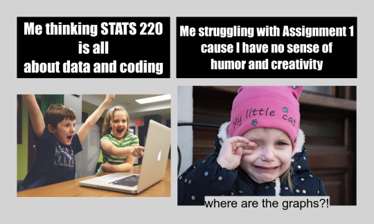

# Meme Assignment
Assignment 1 specifies to make a meme with R through the use of the [magick](https://cran.r-project.org/web/packages/magick/vignettes/intro.html) package.

## Meme origin and thought process
* One of the main inspirations for my meme is my expectations of stats 220 versus the reality of stats 220. I went into stats 220 thinking that I would learn everything that I could to learn skills relating to data. But to my surprise, this first assignment is to be creative and funny. It was quite a challenge to someone like me who hasn’t made anything creative since year 10 art.
  * Thus, the idea to use a happy photo and a sad photo was born to encapsulate what I felt going into stats 220 versus what I think doing assignment 1.
 
* Now that I knew the theme of my meme, it was time to look for the perfect photos to create my meme. At first, it was going to be photos from the currently trending and pop culture icon spiderman 3. However, there are problems in obtaining rights to use pictures [(copyrights)](https://www.copyright.co.nz/understanding-copyright/what-is-copyright) from the movies for my use, so that idea was scrapped entirely.

* So I had decided to use the website [pixabay](https://pixabay.com/) to obtain pictures that are free to use.
  * I used the words happy and crying as keywords to search for the perfect photo. I ended up with a picture of two kids in front of a computer looking triumphant and a crying child.
   
  
  . 


### Creating the meme
Now the creating begins. I had trouble designing a meme that displays all the concepts I have learned so far and shows creativity. However, I realised one important thing when it comes to creating memes.
1. ***Simplicity is key***

So I adapted the meme format where you had a picture and a text beside it. I did it slightly differently, such that my text was above the photo as opposed to beside it. And I also decided to use a rather unique photo of my dog in hopes of making it funny.

And here is the finished product!



### The R code used to create the meme
```r
library(magick)

#creating the first text and the second text
text1 <- image_blank(width = 500, height = 200, color = "#000000") %>%
  image_annotate("Me thinking STATS 220\nis all\nabout data and coding", color = "#FFFFFF", size = 50, font = "Impact", gravity = "center") %>%
  image_border(color = "lightgray", geometry = "10x10")

text2 <- image_blank(width = 590, height = 200, color = "#000000") %>%
  image_annotate("Me struggling with Assignment 1\ncause I have no sense of\nhumor and creativity", color = "#FFFFFF", size = 43, font = "Impact", gravity = "center") %>%
  image_border(color = "lightgray", geometry = "10x10")

#uploading the images needed and scaling them to fit
before.image <- image_read('https://cdn.pixabay.com/photo/2015/01/08/18/24/children-593313_1280.jpg') %>%
  image_scale(502)%>%
  image_border(color = "lightgray", geometry = "10x43")

after.image <- image_read("https://cdn.pixabay.com/photo/2018/04/30/17/45/baby-3363419_1280.jpg") %>%
  image_scale(583.5) %>%
  image_border(color = "lightgray", geometry = "12x15") %>%
  image_annotate(text = "where are the graphs?!", size = 40, boxcolor = "lightgray", gravity = "south")

#arranging all the text 
textrow <- image_append(c(text1,text2))
textrow
photorow <- image_append(c(before.image, after.image))

meme <- c(textrow, photorow) %>%
  image_append(stack = TRUE) %>%
  image_scale(500) %>%
  image_border(color = "lightgray", geometry = "20x20")

#saving the meme into a png file
image_write(meme, "my_meme.png")


```
